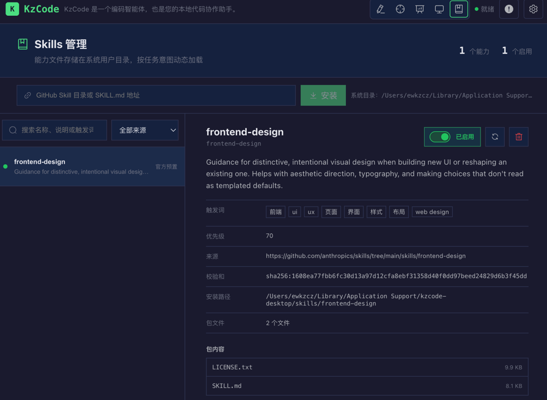

# KzCode：本地代码智能体桌面应用

**KzCode** - 让 AI 成为你的本地代码助手 🚀

> "模型决定 Agent 的上限，Harness 决定 Agent 的下限"

## 项目介绍

KzCode 是一个**本地优先等代码智能体（Coding Agent）桌面应用**，灵感来自 Claude Code 等 AI 工具。它不是简单"聊天 + 文件读写"组合，而是完整的 **Agent 运行时系统（Agent Harness）**。

### 核心设计理念

KzCode 围绕 **Agent Harness** 思想构建，将多模型接入、工具调用、上下文管理、记忆系统、安全边界和运行审计整合成一条**可中断、可恢复、可评测**的执行链路。

**什么是 Agent Harness？**

Agent Harness 是包裹模型的运行时脚手架——模型只负责"下一步决策"，其余全是 Harness 的职责：

- **Agent Loop（循环与熔断）**：控制执行流程，防止死循环
- **工具系统（注册/校验/沙箱）**：提供外部能力的安全执行
- **上下文管理（压缩/记忆/隔离）**：治理有限的上下文窗口
- **权限与安全（确认、Hook 拦截）**：确定性护栏，不依赖模型"自觉"
- **可观测（trace/日志/评测）**：每步可回放，失败可追溯
- **持久化（checkpoint/会话恢复）**：长任务可中断、可续跑

> "模型决定 Agent 的上限，Harness 决定 Agent 的下限"

### 解决的核心问题

在代码仓库的长链路任务中，KzCode 解决以下工程问题：

| 问题 | 传统方案的不足 | KzCode 的解决方案 |
|------|---------------|------------------|
| **上下文膨胀** | 聊天历史无限累积，很快撑爆窗口 | 分层预算裁剪（当前请求永不裁等）；滑动窗口；LLM 结构化摘要总结 |
| **重复读取** | 每次都重新读同一文件，浪费 token | 文件缓存 + 摘要机制等 |
| **状态丢失** | 会话中断后无法恢复现场 | Checkpoint 机制：保存任务快照、运行时身份校验；todo 清单文件等落盘 |
| **工具副作用不可控** | 模型可能执行危险操作 | 多层安全护栏：沙箱隔离、审批流程、黑白名单 |
| **结果难复盘** | 出错后无法追溯完整执行链路 | trace.jsonl 记录运行轨迹 |

### 系统架构

```
用户输入（UI / 终端）
        │
        ▼
┌─────────────────────────────────────────────┐
│         前端（Electron + Vue 3）              │
│  • 流式对话      • 审批面板   • Diff 预览     │
│  • 文件树        • Git 集成   • 主题切换      │
│  • @引用文件     • 内置编辑器                 │
└─────────────────────────────────────────────┘
        │ HTTP + SSE（流式事件）
        ▼
┌─────────────────────────────────────────────┐
│       后端（FastAPI + Agent Harness）         │
│  ┌─────────────────────────────────────┐    │
│  │      Agent Loop（主控制循环）        │    │
│  │  感知 → 决策 → 行动 → 记录 → 循环    │    │
│  └─────────────────────────────────────┘    │
│                                              │
│  ┌──────────┐  ┌──────────┐  ┌──────────┐  │
│  │上下文管理│  │分层记忆  │  │工具系统  │  │
│  │预算裁剪  │  │失效检测  │  │安全隔离  │  │
│  └──────────┘  └──────────┘  └──────────┘  │
│                                              │
│  ┌──────────┐  ┌──────────┐  ┌──────────┐  │
│  │Checkpoint│  │运行工件  │  │多模型    │  │
│  │恢复机制  │  │trace审计 │  │聚合      │  │
│  └──────────┘  └──────────┘  └──────────┘  │
└─────────────────────────────────────────────┘
        │
        ▼
    本地代码仓库
```

### 关键特性

- **✅ 本地优先**：代码不离开本地，隐私可控
- **✅ 多模型支持**：OpenAI / Anthropic / DeepSeek / Ollama，统一接口
- **✅ 分层记忆**：工作记忆 + 会话记忆 + 持久记忆
- **✅ 上下文治理**：结果清理、压缩、LLM 结构化摘要、滑动窗口
- **✅ 安全隔离**：沙箱、审批、黑白名单、环境变量过滤
- **✅ 可恢复**：Checkpoint 外部化/持久化；todo清单等落盘；确保中断后可续跑
- **✅ 可审计**：trace.jsonl 记录完整轨迹
- **✅ 流式体验**：SSE 实时推送工具执行、审批请求、进度通知


## 后端：Agent Harness 架构

后端基于 **FastAPI**，实现了一个完整的本地代码智能体运行框架（Harness）。它的设计目标不是"接一个模型、配几个工具"，而是解决代码仓库长链路任务中的核心工程问题。

### 一、Agent Loop：主控制循环

Agent Loop 是整个系统的心脏，负责驱动"感知 → 决策 → 行动 → 记录"的闭环。

#### 核心流程

```python
# runtime.py 核心循环
while tool_steps < max_steps and attempts < max_attempts:
    # 1. 感知：组装上下文
    prompt, metadata = build_prompt_and_metadata(user_message)
    
    # 2. 决策：模型输出
    raw = model_client.complete(prompt, max_new_tokens)
    
    # 3. 解析：工具调用还是最终答案
    kind, payload = parse(raw)
    
    if kind == "tool":
        # 4. 行动：执行工具
        result = run_tool(payload.name, payload.args)
        
        # 5. 记录：回写历史 + 更新记忆
        update_memory_and_history(result)
        save_checkpoint_and_artifacts()
        continue
    
    # kind == "final" → 返回最终答案
    return payload.text
```

#### 四重熔断机制

防止 Agent 失控烧 token：

| 熔断类型 | 触发条件 | 处理策略 |
|---------|---------|---------|
| **最大步数** | `tool_steps >= max_steps` | 硬性截断 |
| **格式错误** | 模型连续输出无效格式 | 累计达上限后停止 |
| **工具失败** | 同一工具连续失败 | 按工具名+参数计数，达上限停止 |
| **API 错误** | 模型调用异常（超时/限流） | 指数退避重试，耗尽后终止 |

#### 重试策略

- API 错误 → 指数退避：1s → 2s → 4s → 8s → 16s
- 格式错误 → 递增计数，达上限后停止
- 工具失败 → 分别计数（全局 + 单工具），任一达上限停止
- 不可恢复错误（认证失败/模型不可用）→ 直接终止，不重试

#### 缓存策略

系统提示词（角色 + 工具清单 + 工作区基线）相对稳定，生成快照并记录工作区指纹（Git 状态 + 文件树 + 项目文档）。每次运行前检查指纹，无变化时复用缓存，减少重复构建开销。


### 二、上下文管理：渐进式披露与上下文管理

**核心思想**：让模型在有限窗口里看到最有效的决策信息，而不是无脑堆砌。

#### Prompt 结构

KzCode 将 prompt 拆成稳定基线和动态重建，通过固定长前缀，提高缓存命中率：

| 层级 | 片段名称     | 内容                                                 | 稳定性 |
| ---- | ------------ | ---------------------------------------------------- | ------ |
| 1    | **稳定前缀** | 系统角色、全局规则、用户固定偏好、核心任务、关键约束 | 极稳定 |
| 2    | 运行上下文   | 工作区文件树、checkpoint状态                         | 偏稳定 |
| 3    | 摘要、notes  | 最近文件清单 + 文件摘要 + 工具结果摘要 + 任务状态    | 混合   |
| 5    | 相关记忆     | 从历史笔记召回的 Top 3 条                            | 动态   |
| 6    | 对话历史     | 对话历史（滑动窗口 + LLM 结构化压缩）                | 动态   |
| 7    | 当前请求     | 用户最新输入                                         | 极动态 |

**设计原则**：

- 稳定的放前面
- 变化的放后面
- 当前请求放最后且永不压缩

#### 近期文件变更追踪

每次工具执行后记录文件变更（记录行号范围：可验证锚点），保留最近 N 轮，注入运行上下文：

```
最近 10 轮文件变更：
  第 5 轮：
    modified: src/main.py (10-15, 30-35)
    created: src/utils.py (1-50)
  第 4 轮：
    deleted: src/old.py
```

让 AI 感知近期自己改了什么，避免重复操作。

### 三、分层记忆系统：工作记忆 + 会话记忆 + 持久记忆

KzCode 的记忆不是"聊天历史摘要"，而是**分层、可失效、工具驱动**的轻量记忆系统。

#### 三层记忆架构

| 记忆层 | 生命周期 |
|--------|----------|
| **工作记忆** | 请求级 |
| **会话记忆** | 会话级 |
| **持久记忆** | **跨会话级** |

#### 文件摘要失效检测

**核心机制**：每个文件摘要绑定**内容指纹（freshness = 文件哈希）**

**失效触发时机**：

1. **写入文件后**：`write_file` / `patch_file` 执行成功，主动调用 `invalidate_file_summary(path)`
2. **下次会话恢复时**：批量校验所有摘要的指纹，不匹配的直接丢弃
3. **组装提示词时**：实时比对哈希，失效的不注入

#### 过程笔记与相关记忆召回

**过程笔记**：工具执行过程中自动记录的短结论

```json
{
  "text": "Fixed logging format in runtime.py, changed INFO to DEBUG",
  "tags": ["runtime.py", "logging", "patch"],
  "source": "patch_file",
  "created_at": "2026-07-27T10:30:27Z"
}
```

**召回机制**：基于分词匹配，不依赖向量模型

排序规则：**标签精确匹配 > 关键词重叠数 > 时间新旧**

```python
# 评分公式
tag_score = 1 if query_tokens & note.tags else 0
keyword_score = len(query_tokens & note.text.split())
rank_key = (tag_score * 10 + keyword_score, note.created_at)

# 取 Top 3
selected = sorted(notes, key=rank_key, reverse=True)[:3]
```

#### 持久记忆自动沉淀

当用户请求包含"记住/保存/记录"等持久化意图时，自动从最终答案中提取结构化事实：

**沉淀流程**：
1. **意图检测**：匹配 `记住/保存/记录/沉淀` 等关键词
2. **格式匹配**：从答案中逐行提取固定格式（项目约定、决策、依赖、偏好）
3. **拒绝过滤**：
   - 空内容
   - 含 API key/token/secret 等敏感信息
   - 含 checkpoint 状态字段
   - 含 stdout/stderr 等噪声输出
4. **写入**：存入 `.KzCode/memory/topics/` 目录，同名主题自动去重更新

**存储结构**：

```
.KzCode/memory/
├── index.json              # 索引：所有条目的元数据汇总
└── topics/
    ├── runtime_abc123.json # 主题文件：具体内容
    ├── logging_def456.json
    └── config_ghi789.json
```

**索引文件示例**（`index.json`）：

```json
{
  "entries": [
    {
      "id": "mem_001",
      "topic_file": "topics/runtime_abc123.json",
      "title": "主循环结构",
      "tags": ["runtime", "control_flow", "ask"],
      "source_file": "KzCode/runtime.py",
      "source_hash": "a1b2c3d4e5f6",  // 写入时文件哈希，用于冲突校验
      "created_at": "2026-07-20T10:00:00Z",
      "last_accessed": "2026-07-25T14:30:00Z",
      "decay_weight": 0.85,  // 时间衰减权重
      "status": "active"     // active / stale
    }
  ]
}
```

### 四、工具系统：受控执行链与安全隔离

KzCode 将工具层视为**受控执行链**，所有工具调用必须经过统一网关 `run_tool()`，经过多道护栏。

#### 可用工具集

| 工具 | 作用 | 风险级别 | 关键约束 |
|------|------|---------|----------|
| `list_files` | 列出工作区目录内容 | 只读 | 沙箱隔离，禁止逃逸 |
| `read_file` | 按行范围读取文件 | 只读 | 行号合法，自动生成摘要 |
| `search` | 搜索文本模式 | 只读 | pattern 非空，优先 rg |
| `run_shell` | 执行 shell 命令 | **高危** | 超时 1-120s，环境变量白名单 |
| `write_file` | 写入文本文件 | **高危** | 不能写目录，使摘要失效 |
| `patch_file` | 精确替换文本 | **高危** | old_text 必须唯一出现 |
| `delegate` | 派生子 agent 调研 | 只读 | 默认 3 步上限，只读模式 |

#### 审批判定流程

```
工具调用
   │
   ▼
┌──────────┐  不合法
│ 参数校验 ├─────────→ 拦截并返回错误
└────┬─────┘
     │ 通过
     ▼
┌──────────┐  重复
│ 重复检测 ├─────────→ 拦截
└────┬─────┘
     │ 新调用
     ▼
┌──────────────────┐  是
│ read_only/never? ├─────────→ 拦截
└────┬─────────────┘
     │ 否
     ▼
┌──────────────┐  逃逸
│ 沙箱隔离检测 ├─────────→ 需要审批
└────┬─────────┘
     │ 安全
     ▼
┌──────────┐  命中
│ 黑名单   ├─────────→ 需要审批
└────┬─────┘
     │ 未命中
     ▼
┌──────────┐  命中
│ 白名单   ├─────────→ 自动放行
└────┬─────┘
     │ 未命中
     ▼
┌──────────────────┐
│ approval_policy  │── ask ──→ 需要审批
│      == ask?     │── auto ─→ 自动放行
└──────────────────┘
```

#### 四层安全护栏

| 优先级 | 规则 | 命中后果 | 实现方式 |
|--------|------|----------|----------|
| **1** | **沙箱隔离** | 必须审批 | • 拦截 `..` 父目录引用<br/>• 审核绝对路径是否逃逸<br/>• 审核 `~` 开头路径 |
| **2** | **黑名单** | 必须审批 | fnmatch glob 匹配：<br/>`git*` `rm*` `del*` `rmdir*` `Remove-Item*` |
| **3** | **白名单** | 自动放行 | fnmatch glob 匹配：<br/>`ls*` `cat*` `grep*` `rg*` `find*` |
| **4** | **审批策略** | 按配置决定 | • `ask`：沙箱/黑名单外也要审批<br/>• `auto`：只审批沙箱逃逸和黑名单<br/>• `never`：拒绝所有写操作 |

#### 环境隔离与敏感信息脱敏

**环境变量白名单**：

```python
SHELL_ENV_ALLOWLIST = [
    "PATH", "HOME", "USER", "SHELL", "LANG", 
    "LC_ALL", "TMPDIR", "TEMP", "TMP"
]

# run_shell 执行时只传递白名单中的环境变量
env = {name: os.environ[name] 
       for name in SHELL_ENV_ALLOWLIST 
       if name in os.environ}
env["PWD"] = workspace_root  # 覆盖 PWD
```

**敏感信息脱敏**：

```python
SENSITIVE_ENV_NAME_MARKERS = (
    "API_KEY", "TOKEN", "SECRET", "PASSWORD"
)

# 敏感变量值在 trace/report 写入前替换为 <redacted>
# 正则拦截：匹配 api_key、token、secret、sk- 等
# 在记忆沉淀前拦截，防止泄漏到持久化存储
```

### 五、Checkpoint 恢复机制：中断可续跑

KzCode 采用**双层恢复机制**，保证长任务可中断、可恢复：

#### Session vs Checkpoint

| 机制 | 存储内容 | 使用场景 |
|------|----------|----------|
| **Session** | • 会话历史<br/>• 工作记忆 | "下次还能接着聊" |
| **Checkpoint** | • 任务状态快照<br/>• 当前目标/卡点<br/>• 下一步动作<br/>• 关键文件指纹<br/>• 运行时身份 | "中断后恢复现场" |

#### 恢复场景覆盖

| 场景 | 恢复策略 |
|------|----------|
| **基础恢复** | 完全可用，直接续跑 |
| **部分状态过期** | 文件摘要失效检测 |
| **Workspace 漂移** | 指纹不匹配，重建状态 |
| **工具半成功** | 从安全点恢复 |

### 六、trace 轨迹和 eval 评测闭环

每次 `ask()` 调用会在 `.KzCode/runs/{run_id}/` 下生成完整的轨迹，实现**可审计、可评测**。

#### trace.jsonl 事件类型

`trace.jsonl` 是 **JSON Lines 格式**（每行一个独立 JSON 对象），记录运行时所有关键事件：

```jsonl
{"event": "run_started", "run_id": "run_001", "task_id": "task_001", "timestamp": "..."}
{"event": "prompt_built", "attempt": 1, "prompt_metadata": {"prefix_len": 3600, "total_prompt_chars": 4120}}
{"event": "model_requested", "model": "gpt-4", "cache_hit": false, "input_tokens": 1500}
{"event": "model_parsed", "kind": "tool", "tool_name": "read_file"}
{"event": "tool_executed", "tool_name": "read_file", "status": "success", "affected_paths": ["main.py"]}
{"event": "run_finished", "status": "completed", "stop_reason": "final_answer_returned"}
```

**事件分类**：
- **生命周期**：`run_started`、`run_finished`
- **推理与上下文**：`prompt_built`、`model_requested`、`model_parsed`
- **工具执行**：`tool_executed`、`tool_rejected`
- **状态持久化**：`checkpoint_created`、`memory_updated`
- **异常重试**：`retry_triggered`

#### 多层评测体系

KzCode 将评测拆成多层，不混成一个总分：

| 评测层 | 评估内容 | 关键指标 |
|--------|----------|----------|
| **Harness 回归** | 运行时合同稳定性 | 通过率、预算内完成率、verifier 通过率 |
| **上下文治理** | 压缩效果 | 压缩率、当前请求是否被裁坏 |
| **记忆收益** | 减少重复操作 | 重复读文件次数、工具步数 |
| **恢复正确性** | 断点续跑能力 | 恢复成功率、漂移识别率 |
| **模型后端对照** | 多模型表现 | 不同 provider 的 pass rate / attempts / tool_steps |

### 七、多模型聚合

KzCode 不绑定特定模型提供商，支持通过统一接口切换后端。

#### 支持的模型提供商

支持自定义模型提供商，兼容多种格式

| 提供商 | 协议 | 配置方式 | 特点 |
|--------|------|----------|------|
| **OpenAI** | OpenAI 兼容 | API Key + Base URL | GPT-4、GPT-4-turbo 等 |
| **Anthropic** | Anthropic 消息 API | API Key + Base URL | Claude Sonnet、Opus 等 |

#### 统一抽象层

所有模型客户端共享同一组调用接口，Agent 运行时无需感知底层模型差异：

**切换模型**：只需修改配置文件或环境变量，无需改动代码。

#### 错误码归一化

统一错误码，捕获并逐层向上抛出用户友好的报错信息，日志留痕，拒绝泄露系统实现；

### 八、SSE 流式事件系统

`POST /api/chat-stream` 端点通过 **Server-Sent Events (SSE)** 将 Agent 控制循环与前端实时同步。

#### 事件类型

| 事件 | 触发时机 |
|------|----------|
| `chunk` | 流式文本增量 |
| `tool_call` | 工具开始执行 |
| `tool_result` | 工具执行完成 |
| `approval_request` | 高危工具需审批 |
| `assistant_notice` | 进度通知 / 异常通知 |
| `done` | 返回最终答案 |
| `error` | 不可恢复错误 |

#### Hook 机制

**核心思想**：不修改 agent 核心代码，而是在运行前用钩子函数替换 `record()` 方法，避免耦合。

```python
# 运行前注入钩子
original_record = agent.record
agent.record = hooked_record

def hooked_record(entry):
    # 拦截每次工具执行结果写入 history 时
    original_record(entry)  # 先调用原方法
    
    # 同步生成 SSE 事件
    if entry["role"] == "tool":
        event_queue.put({
            "type": "tool_result",
            "data": {...}
        })
    
    # 持久化到审计日志
    audit_timeline.append({
        "timestamp": now(),
        "event": entry
    })
```

**好处**：
- 不侵入 Agent 核心逻辑
- SSE 推送与审计持久化同步进行
- 支持热插拔（测试时可不挂钩子）


## 前端：Electron 桌面应用

前端基于 **Electron + Vue 3 + Pinia + Element Plus**，提供原生桌面体验，将 Agent 能力以直观的交互形式呈现。

### 一、技术栈

| 层级 | 技术 |
|------|------|
| **桌面框架** | Electron 33 |
| **前端框架** | Vue 3 (Composition API) |
| **构建工具** | Vite 6 + electron-vite |
| **状态管理** | Pinia |
| **UI 组件** | Element Plus |
| **样式** | CSS Variables（12 套主题） |
| **通信协议** | HTTP + SSE（流式）、Electron IPC（文件系统） |

### 二、核心功能

#### 会话与流式对话

**会话管理**：

- 左侧边栏展示所有会话
- 支持新建、重命名、删除、固定会话
- 会话列表按更新时间排序
- 固定会话置顶显示

**流式对话**：
- 实时接收 SSE 事件流
- 支持 Markdown 渲染（代码高亮、表格、列表）
- 打字机效果显示 AI 回复
- 工具调用实时展示（折叠/展开）

#### 工具执行与审批

**工具执行面板**：
- 显示工具名称、参数、执行状态
- 成功/失败状态用不同颜色标识
- 支持查看完整的工具输出
- 显示受影响的文件列表

**审批流程**：
```
高危工具调用
      ↓
SSE approval_request 事件
      ↓
前端弹出审批面板
  • 工具名称
  • 参数预览
  • 风险提示
      ↓
用户选择：允许 / 拒绝
      ↓
POST /api/approval/{approval_id}
      ↓
后端继续执行 / 拦截
```

**审批面板特性**：
- 600 秒超时（自动拒绝）
- 参数 JSON 格式化显示
- 高危命令高亮提示
- 支持批量审批（记住选择）

#### 文件变更 Diff 预览

**Diff 查看器**：
- Unified diff 格式展示
- 语法高亮（基于文件扩展名）
- 增删行用不同背景色标识
  - 新增行：绿色背景
  - 删除行：红色背景
  - 上下文行：默认背景
- 支持折叠/展开大文件 diff
- 显示变更文件数量和行数统计

**实时推送**：
- 工具执行完成后立即推送 diff
- SSE `tool_result` 事件携带 `diff_preview`
- 前端自动解析并渲染

#### @引用文件与附件上传

**@引用机制**：
```
用户输入：修改 @src/main.py 的日志格式
           ↓
前端检测 @ 符号
           ↓
弹出文件选择下拉菜单
  • 最近打开的文件
  • 当前项目文件树
           ↓
选择文件后插入路径
           ↓
发送时提取 @文件路径
           ↓
后端自动读取文件内容注入上下文
```

**附件上传**：

- 支持拖拽上传文件
- 支持点击选择文件
- 图片附件缩略图预览
- 文本附件内容读取后注入上下文

#### 项目文件树与内置编辑器

**文件树**：
- 递归展示项目目录结构
- 支持展开/折叠文件夹
- 文件图标（基于扩展名）
- 右键菜单：
  - 在编辑器中打开
  - 复制路径
  - 在文件管理器中显示
- 搜索过滤文件

**内置编辑器**：
- 基于 Monaco Editor（VS Code 同款）
- 语法高亮（支持 50+ 语言）
- 代码补全
- 快捷键：Ctrl+S 保存
- 支持多标签页
- Diff 模式（对比修改前后）

#### Git 集成

**Git 状态展示**：
- 当前分支名称
- 未暂存/已暂存文件列表
- 文件变更状态图标（M/A/D/?）

**Git 操作**：
- 查看 diff
- Stage/Unstage 文件
- Commit（带消息输入）
- 查看提交历史
- 切换分支

**实现方式**：

- Electron 主进程调用 `simple-git` 库
- 通过 IPC 与渲染进程通信
- 前端通过 `window.api.git.*` 调用

#### 设置与主题

**设置面板**：

- 模型配置：
  - 选择模型提供商（OpenAI/Anthropic/DeepSeek/Ollama）
  - API Key 输入
  - Base URL 配置
  - 模型选择器
- 工具权限：
  - 审批策略（ask/auto/never）
  - 只读模式开关


## 快速开始

### 一、环境要求

| 依赖 | 版本要求 |
|------|---------|
| **Python** | 3.10+ |
| **Node.js** | 18+ |
| **npm** | 9+ |
| **uv** | 最新版（Python 包管理器） |

### 二、后端启动

```bash
# 进入后端目录
cd KzCode

# 安装 Python 依赖
uv sync

# 启动 API 服务器（默认端口 11435）
uv run python -m app.api_server --port 11435

# 或使用 CLI 模式
uv run python -m app.cli
```

**配置模型**：

在 `KzCode/.env` 文件中配置 API Key：

```bash
# OpenAI
OPENAI_API_KEY=sk-...
OPENAI_BASE_URL=https://api.openai.com/v1

# Anthropic
ANTHROPIC_API_KEY=sk-ant-...
ANTHROPIC_BASE_URL=https://api.anthropic.com

# DeepSeek
DEEPSEEK_API_KEY=sk-...
DEEPSEEK_BASE_URL=https://api.deepseek.com

# Ollama（本地）
OLLAMA_HOST=http://localhost:11434
```

### 三、前端启动

```bash
# 进入前端目录
cd KzCodeDesktop

# 安装 Node 依赖
npm install

# 开发模式（Electron 桌面应用，自动启动后端）
npm run dev:electron

# 开发模式（仅 Web，无 Electron）
npm run dev       # → http://localhost:5173

# 生产构建
npm run build:electron
```

### 四、运行测试

```bash
cd KzCode

# 运行所有测试
uv run pytest

# 运行特定测试
uv run pytest tests/test_context_manager.py
uv run pytest tests/test_memory.py
uv run pytest tests/test_safety_invariants.py

# 查看覆盖率
uv run pytest --cov=app --cov-report=html
```

### 五、打包发布

项目打包分两层：**后端**用 PyInstaller 编译成独立 exe，**前端**用 electron-builder 打成安装包。

#### 后端打包

```bash
cd KzCode

# Windows
powershell.exe -File scripts/package-backend.ps1

# macOS/Linux
bash scripts/package-backend.sh

# 输出：backend-dist/KzCodeBackend.exe（或二进制文件）
```

#### 前端打包

```bash
cd KzCodeDesktop

# 1. 先构建前端
npm run build:electron

# 2. 打包安装程序
npm run package

# 输出：dist/KzCode Setup x.x.x.exe（Windows）
#      dist/KzCode-x.x.x.dmg（macOS）
```

**electron-builder** 配置中通过 `extraResources` 自动将 `backend-dist/` 目录嵌入安装包，最终交付一个独立的安装包。


## 最近更新和计划

最近更新

- 新增了模型交互跟踪可视化展示页面；
- 新增了评测结果可视化展示页面；
- 新增了 plan 模式，目前支持 ask/agent/plan 三种模式运行；
- 接入了 Skills 能力；
- 实现了基于 AST 抽象语法树的提示词统一管理（抽取 → 写回）模块：将分散在多个文件各处的、以“system_prompt_”为前缀的系统提示词变量，基于 AST 进行统一管理。
- ......

短期计划

- 接入 MCP 工具能力；
- 实现运行轨迹的可视化展示；
- 实现长期记忆的可视化展示，并允许用户自行增删改；
- ......

长期计划

- 基于 TS 重构 Harness 运行时，移除 Python 实现，基于 electron-update 实现从云端拉取增量更新、热更新，可避免 Python 打包无法跨平台和安装包分发困难问题，减少安装包体积；
- 将部分功能迁移至云端，Python 替换为本地 TS + 云端 Java/Go 的架构；
- 实现 Tab 自动补全功能；
- 前端优化；
- ......

模型交互追踪可视化


评测可视化


Skills


